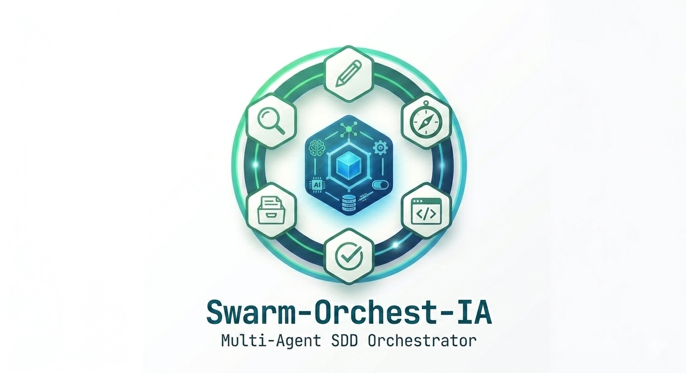

<p align="center">
  
</p>

<p align="center">
  Orquesta el desarrollo guiado por especificaciones (SDD) con un equipo de agentes de IA.<br>
  Agnóstico de la herramienta — OpenCode hoy, más soportes en camino.<br>
  Minimalista, estructurado y fácil de usar.
</p>

<p align="center">
  <a href="https://github.com/dsquintero/Swarm-Orchest-IA/actions/workflows/ci.yml"></a>
  <a href="LICENSE"></a>
</p>

## Qué hace

Swarm-Orchest-IA coordina un equipo de agentes especializados de IA para seguir un flujo de desarrollo
guiado por especificaciones:

```
exploring → spec-writing → design → implementing → verifying → archiving
```

Cada fase la ejecuta un agente distinto con el modelo óptimo para su tarea. El orquestador coordina las
transiciones y el usuario aprueba cada avance.

## Instalación

```bash
npm install -g swarm-orchest-ia   # expone el comando `soia`
```

> ⏳ La publicación en npm está en camino (F11). Por ahora se instala **desde el código** — ver
> [DEVELOPMENT.md](DEVELOPMENT.md).

## Uso

```bash
soia init            # prepara un proyecto (pregunta modo Global o Local)
soia models          # muestra la configuración de modelos por agente
soia update          # re-sincroniza plantillas y modelos
```

Una vez inicializado, abrí el proyecto en tu herramienta de IA y arrancá el flujo SDD con
`/soia-propose "tu feature"`.

Guía completa (comandos, validaciones, flujo SDD, agentes): **[docs/usage.md](docs/usage.md)**.

## Requisitos

`soia` solo prepara la estructura. El ecosistema necesita además **OpenCode** instalado y un
**proveedor de modelos** configurado. Detalle en [docs/usage.md](docs/usage.md#prerrequisitos).

## Documentación

- **Usar la herramienta** → [docs/usage.md](docs/usage.md)
- **Desarrollarla** (build, tests, estructura) → [DEVELOPMENT.md](DEVELOPMENT.md)
- **Contribuir** (flujo, convenciones) → [CONTRIBUTING.md](CONTRIBUTING.md)
- **Estado y roadmap** → [ROADMAP.md](ROADMAP.md)
- **Índice de toda la documentación** → [docs/README.md](docs/README.md)

## Licencia

MIT
